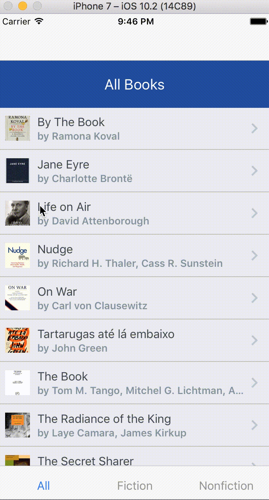

## ReactNative and Mobx Tutorial

Repo for tutorial on [building Mobile Applications in ReactNative](https://qaiser.com.au/react-native-tutorial).

## Topics Covered

There are four parts in this series. We'll cover different topics and libraries necessary to create and test a full blown React Native application: 

1. In [part I](https://qaiser.com.au/react-native-tutorial/prettier-eslint-airbnb-styleguide), we'll setup prettier, eslint, and arirbnb style guide for our project.
2. In [part II](https://qaiser.com.au/react-native-tutorial/drawer-navigation-tabs-with-react-navigation), we'll add Drawer and Tabs Navigation using react-navigation.
3. In [part III](https://qaiser.com.au/react-native-tutorial/testing-with-jest-enzyme), we'll test our React components with Jest and Enzyme
4. In [part IV](https://qaiser.com.au/react-native-tutorial/mobx-state-tree), we'll work on the state management of our app using MobX (mobx-state-tree). It will also involve some UI changes and more navigation. We'll sort and filter the books by genre, and allow the user to see the Book detail screen when the user taps on a book.

Here's a demo of the Bookstore app we're going to build:

